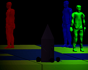
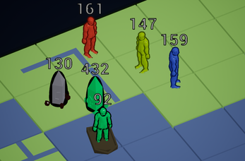
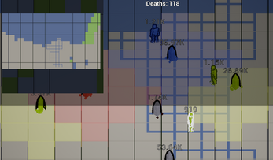
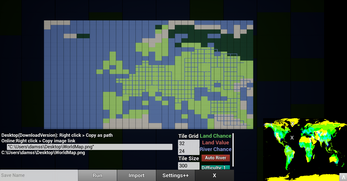
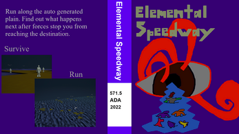
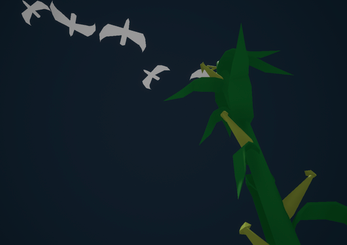
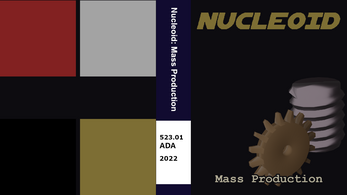
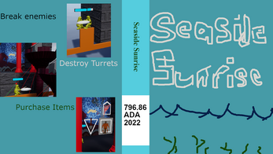

if none of the ue4 html does not work then try: https://beklitepe.itch.io/
### nationOnDust
https://robolewigi.github.io/bekliOther/nodHtml/

RTS sandbox world map

Development Versions https://drive.google.com/drive/folders/1UMftv8atENR_G23vBfW_iKy2zAt7apUc

  
  
  
  

### elementalSpeedway
https://robolewigi.github.io/bekliOther/isometricRunwayHtml/

a sandbox where you can walk attack and allocate points
WASD, Mouse and left button,Enter

  
  

### nucleoid-massProduction

small idle game using elements

  

### seasideSunrise

small moba like game

  

